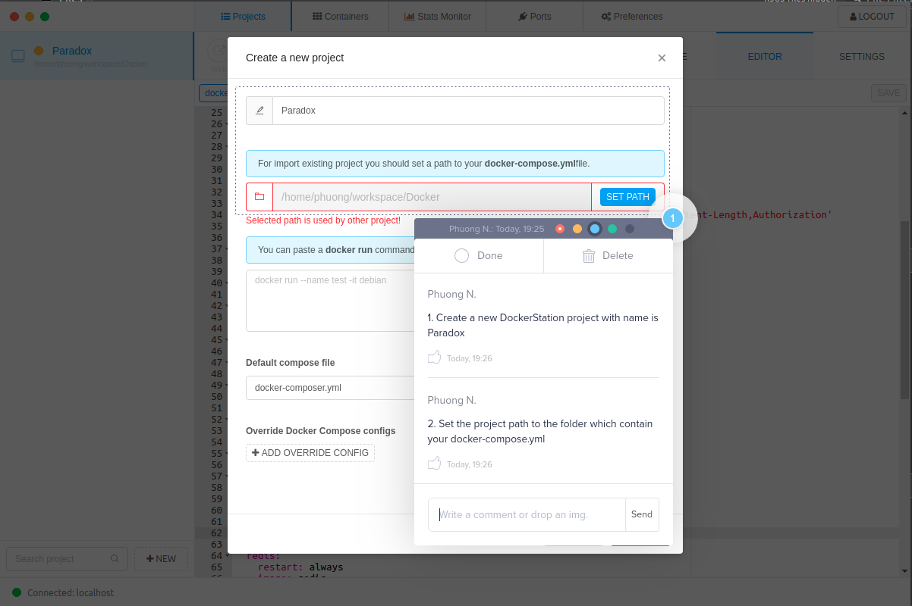

Install nix
https://nixos.org/download/
After install. Run `nix-shell` to install independency this command will create .venv folder

Setup Docker
+ https://docs.docker.com/docker-for-mac/install/
+ Set the path to the compose file in the Docker settings to `./docker-compose.yml`

Run:
+ `source .venv/bin/activate` to access environment
+ `pip install -r requirement.txt`

To setup project.
+ `python manage.py migrate`
+ `python manage.py runserver`

Database URL:
https://lucid.app/lucidchart/5988b41c-a6e6-4408-aa6f-653b2cfdc8b8/edit?view_items=hXpeYMkz61t3&invitationId=inv_17d07a06-7411-442a-8181-edf5b4d618f2

If you have any issues with the database, contact me in YUP: ``TM Duc Nguyen``

